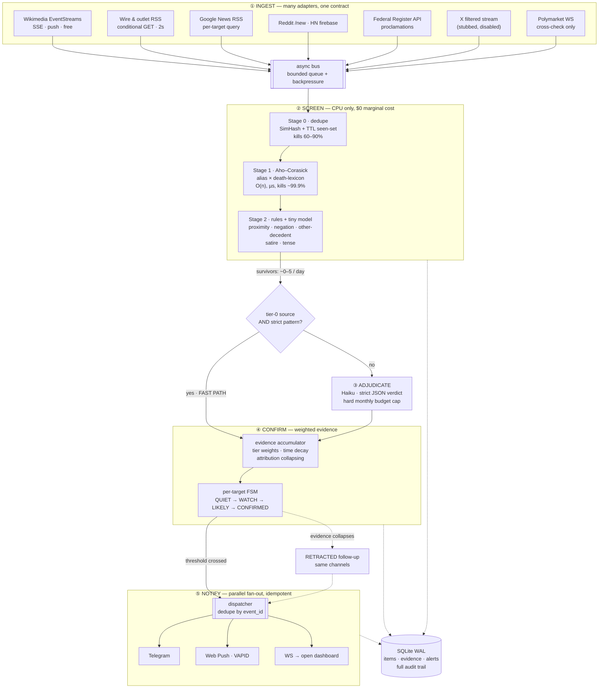

# news-ticker-daemon — Architecture

A 24/7 daemon that watches news + structural data streams for a small set of
pre-registered high-impact events (primarily: the death of a named public
figure) and pushes a notification to the operator's phone within seconds of the
first credible report.

Design constraints that shaped everything below:

| Constraint | Consequence |
|---|---|
| 2 vCPU / 911 MB RAM box | Single async process. SQLite (WAL), no Redis/Postgres/Docker. |
| Zero marginal AI cost on routine volume | Tiered funnel: ~99.99% of items are killed by CPU-only stages. |
| Seconds matter | Push transports (SSE/WS) preferred over polling; fast path bypasses adjudication. |
| False positive costs real money | Weighted, independence-aware corroboration + retraction path. |
| Must not silently die | systemd watchdog + per-source staleness alarms + daily synthetic drill. |

---

## 1. The honest latency picture

Read this before optimizing anything, because it determines where effort pays off.

```
real-world event
   │
   ├── (minutes → hours)  ← family/official confirmation, wire verification.  DOMINANT TERM. Not addressable.
   │
   wire publishes headline
   │
   ├── (0.1 – 2 s)        ← our ingest. ADDRESSABLE: source choice + push vs poll.
   │
   item enters funnel
   │
   ├── (< 1 ms)           ← screening. Already free. Do not micro-optimize.
   │
   verdict: FIRE
   │
   ├── (0.3 – 2 s)        ← Telegram/FCM delivery. Partly addressable: parallel fan-out.
   │
   phone buzzes
```

**The race you are actually in is against other people's bots, not against the
news cycle.** Everyone credible learns about it from the same wire headline at
roughly the same instant. So the wins available to you, ranked by value:

1. **Source breadth on the earliest tier** — being subscribed to the one stream
   that broke it 40 seconds before the others. This is worth more than every
   other optimization combined.
2. **Being awake** — an alert that wakes you at 04:00 beats a 200 ms faster
   pipeline you slept through. Hence the phone-call channel recommendation.
3. **Pre-staged orders** — the notification should deep-link to a venue with the
   order pre-filled. Your reaction time is 5–15 s; the pipeline's is 3 s.
4. Micro-latency in the daemon. Real, but the smallest term. Do it last.

Realistic end-to-end target: **2–5 s from wire publication to phone buzz.**

---

## 2. Pipeline overview



---

## 3. ① Ingest

One contract, many adapters (`ticker/ingest/base.py`):

```python
class SourceAdapter(ABC):
    id: str            # "ap-topnews"
    tier: int          # 0 = wire/official, 1 = major outlet, 2 = regional, 3 = social
    expected_cadence_s: float   # feeds the staleness watchdog
    async def run(self, emit: Callable[[Item], Awaitable[None]]) -> None: ...
```

Every adapter stamps `Item.t_source` (publisher timestamp, if given) and
`Item.t_ingest` (our `time.monotonic_ns()`), so latency is measurable per hop
for the whole life of the project. You cannot tune what you do not measure.

**Push beats poll.** Ranked by value for a VIP-death event:

| Source | Transport | Cost | Why it matters |
|---|---|---|---|
| Wikimedia EventStreams | SSE (push) | free | `recentchange` firehose. An edit adding a death date to the target's page, or `Category:2026 deaths`, is a *very* high-signal, near-real-time oracle. Editors are fast and often beat outlet homepages. |
| Wikidata P570 | same SSE stream | free | `P570` = date of death. A structured-data write is unambiguous — no NLP needed. |
| Outlet RSS | HTTP/2 + conditional GET *where supported* | free | The workhorse — but see the correction below. |
| Google News RSS query | poll | free | Broad recall across thousands of outlets via one URL per target. |
| Federal Register API | poll | free | For a US president: proclamations (national day of mourning, flags at half-staff) are *official* tier-0 confirmation. |
| Reddit `/r/news/new`, HN firebase | poll / push | free | Good recall, low precision. Tier 3 — contributes evidence weight, never fires alone. |
| X filtered stream | WS (push) | ~$1–5/mo | Now the most valuable paid source, precisely because the wires have no free feed left. Built, tested offline, disabled pending credentials. Cost controls and the full pricing picture are in [X_API_COSTS.md](X_API_COSTS.md). |
| Polymarket / Kalshi WS | WS (push) | free | **Not a news source.** A cross-check: a violent repricing with no news means either you missed something or someone is wrong. Also a "you are already late" detector. |

### Two corrections from actually probing this box

**1. There is no free tier-0 wire feed anymore.** `feeds.reuters.com` does not
resolve, `apnews.com/index.rss` returns **401**, and `feeds.apnews.com` is gone.
Both wires retired public RSS. This breaks the naive version of the fast path —
there is nothing free to fast-path *on*.

The fix, implemented in `confirm/evidence.py:effective_tier()`: recover the tier
from **attribution** rather than from the transport. An aggregator item reading
"…, according to AP" *is* an AP datapoint, so it is promoted to `Tier.WIRE` and
becomes fast-path eligible. Google News becomes the transport; attribution
parsing recovers the provenance. The X adapter does the same thing per-account:
a post from `@AP` or `@POTUS` is wire-grade, one from `@nytimes` is not.

**2. Conditional GET is not as widely supported as this doc originally claimed.**
Measured, 2026-08-13:

| Feed | ETag | Last-Modified |
|---|---|---|
| whitehouse.gov (both feeds) | ✅ | ✅ |
| aljazeera.com | ✅ | ✅ |
| theguardian.com | ✅ | — |
| cbsnews.com | — | ✅ |
| **bbci.co.uk, nytimes.com, npr.org, federalregister.gov** | ❌ | ❌ |

So for four of the highest-value feeds, every poll transfers the full body
(~30–80 KB). That is why intervals in `config/sources.yaml` are 3–5 s rather
than the 1 s this doc first implied. Sub-second polling on a no-cache-header feed
is ~5 MB/minute and a fast route to being rate-limited exactly when it matters.

> **Feeds rot, so verify continuously.** `tools/validate_sources.py` re-probes
> every URL and reports entry counts *and* cache-header support. Run it weekly
> from cron. Treat any URL in this repo as unverified until that tool passes it —
> a dead feed is indistinguishable from a quiet news day, which is this system's
> most dangerous failure mode.

---

## 4. ② Screen — this is the answer to "no AI cost per article"

A cascade where each stage is roughly 100× more expensive and 100× rarer than
the one before it. **Measured** against the live source set (90 s dry-run,
2026-08-13):

```
370 items  →  Stage 0 dedupe    →  34 killed  (9.2%)
           →  Stage 1 automaton → 265 killed (71.6%)
           →  Stage 2 rules     →  70 killed
           →  Stage 3 LLM       →   1 candidate (score 0.678, correctly ambiguous)
```

Caveat on extrapolation: that 370 is dominated by the initial full load of every
feed, so it is not a daily rate — steady state is far lower. What it does
establish is the kill distribution, and that **one** item per run reaches the
LLM. That is what keeps the bill in the cents-per-month range.

Getting there took two rounds of tuning against real headlines. The first live
run produced **39 candidates**, including a cluster that would have fired a false
CONFIRMED — see §4.1.

**Stage 0 — dedupe.** 64-bit SimHash over shingles + an in-memory TTL seen-set.
Syndication means the same AP story appears at 200 outlets; near-dupe detection
kills the flood. Cheap and the single biggest volume reduction.

**Stage 1 — Aho–Corasick automaton.** One compiled automaton holds *every*
pattern for *every* target: all aliases (`Donald Trump`, `Donald J. Trump`,
`President Trump`, `DJT`, `Trump`) × the death lexicon (`dies`, `dead`,
`died`, `passed away`, `obituary`, `succumbed`, `in memoriam`, `1946-`, …).
Aho–Corasick scans input in O(n) **independent of pattern count** — one pass,
microseconds per headline, millions per second on one core. This is the
mechanism that makes "screen everything for free" true rather than aspirational.
Adding your 50th target costs no additional scan time.

**Stage 2 — disambiguation. The precision layer, and where the real work is.**
Still zero marginal cost. For "Trump" specifically the false-positive classes are
brutal and each needs an explicit rule:

| False positive | Example | Rule |
|---|---|---|
| **Someone else died** ← *the #1 class* | "Trump mourns death of former aide" | If another PERSON candidate sits closer to the death term than the target, reject. `mourns / condolences / tribute / reacts to / attends funeral / orders flags` ⇒ strong negative. |
| Conditional / hypothetical | "What happens if Trump dies in office" | Modal & conditional detection: `if / would / could / should / were to / in the event`. |
| Idiom | "dead heat", "dead in the water", "dying industry" | Idiom blocklist, matched before the death lexicon. |
| Metaphor | "the political death of Trumpism" | Require the death term to govern a *person*, not an `-ism`/policy noun. |
| Threat / attempt | "death threats against Trump", "assassination attempt" | `threat / plot / attempt / survived / wounded` ⇒ negative. |
| Satire | The Onion, Babylon Bee | Domain blocklist, hard reject. |
| Anniversary / retrospective | "on the anniversary of…" | Past-reference markers + date-distance check. |
| Fiction | novel/film plot summaries | Section/context heuristics. |

Output is a score, not a boolean. Hand-written rules produce the features; a
~50 KB logistic-regression model (trained offline on labelled historical
headlines, exported to plain numpy) combines them in microseconds. No API, no
GPU, no per-item cost.

### 4.1 What live data taught us that synthetic tests could not

The first dry-run against real feeds produced 39 candidates in 100 seconds. Every
class below is a *real* headline, now frozen in
`tests/fixtures/live_negatives.txt` and enforced by `tests/test_live_negatives.py`.

**The one that mattered.** On 2026-08-13, Senator Lindsey Graham died. The wires
described him as a Trump ally:

```
0.922  Lindsey Graham, key ally of Donald Trump, dies after sudden illness — The Guardian
0.837  Lindsey Graham, US Republican senator and Trump ally, dies at 71 — Al-Monitor
0.837  Lindsey Graham, Senate Hawk Turned Trump Ally, Dies at 71 — Bloomberg
0.757  Lindsey Graham, Republican Senator and Staunch Trump Ally, Dies at 71 — NYT
```

Several are above `min_score` (0.80), from independent tier-1 origins. Two of
those confirm ⇒ **the system would have alerted that Donald Trump had died,
because a senator did.** This is the exact failure this project cannot afford.

Why the existing `other_person_nearer` rule missed it: in an appositive headline
(`X, ally of Y, dies`) the target Y sits *closer* to the verb than the real
subject X does, so proximity attribution is actively backwards. The fix
(`subject_is_other`) uses the fact that English headlines are subject-first: a
person named ahead of the target, with the target introduced by an appositive
comma or a preposition (`of`, `ally`, `aide`, `critic`…), owns the verb.

| Class | Real example | Fix |
|---|---|---|
| **Appositive subject** | "Lindsey Graham, key ally of Donald Trump, dies" | `subject_is_other`, −4.6 |
| **Generic human subject** | "California man known for pro-Trump displays dies" | `generic_subject`, −3.4 |
| **Surname collision** | "Larry Trump Obituary", "George Trump Obituary" | `foreign_given_name_spans()` — structural, since these cannot be enumerated |
| **Future conditional** | "free beer when Trump dies" (12 variants!) | `_FUTURE_COND`, −4.2 |
| **Negated death** | "wishes the fund wasn't dead" | `negated_death`, −4.5 |
| **Scare-quoted** | "Anti-weaponization fund is 'dead'" | `quoted_death`, −3.2 |
| **Self-flagged metaphor** | "Trump dies on stage (metaphorically)" | `explicit_metaphor`, −5.0 |

Result: 39 candidates → 1, with negatives topping out at **0.221** against true
positives at **0.906–0.970** — a clean margin rather than a fragile threshold.

Two lessons worth keeping:

1. **Enumerated negation does not scale.** `Fred Trump` and `Ivana Trump` can be
   listed in config; the unbounded supply of local-obituary Trumps cannot. That
   class needs a structural rule.
2. **Proximity is not attribution.** Every remaining false positive at the fire
   threshold was a case where the death verb was near the target but belonged to
   someone else. Grammatical role beats token distance.

**Stage 3 — LLM adjudication, only for the handful that survive.** Because
volume here is ~2/day, you can afford the *best* judgment. Claude Haiku, strict
JSON out (`{verdict, confidence, subject, reasoning}`), with a hard monthly
spend cap in `config/settings.toml` that fails closed to the Stage-2 score.
This inverts the usual cost problem: the model never sees routine volume, so
the bill is cents per month regardless of news volume.

---

## 5. ④ Confirm — weighted evidence, not a boolean

Each surviving item contributes weight to a per-target accumulator:

| Evidence | Weight | Notes |
|---|---|---|
| Tier-0 wire (AP, official gov proclamation) | 1.00 | Alone crosses the threshold ⇒ fast path. |
| Structural (Wikidata P570 / Wikipedia death date) | 0.40 | Unambiguous but vandalizable — never fires alone. |
| Tier-1 major outlet | 0.50 | Two independent ⇒ 1.00. |
| Tier-2 regional / aggregator | 0.20 | |
| Tier-3 social / unverified | 0.10 | Capped total contribution of 0.20, regardless of volume. |

**The arithmetic is exact on purpose, and that turned out to be fragile.**
`MAJOR = 0.50` exists so two independent majors sum to precisely 1.00. Two bugs
found by `tests/test_end_to_end.py` both defeated that:

- The accumulator originally multiplied tier weight by the raw Stage-2 score, so
  two majors reached `0.5 × 0.97 × 2 = 0.97` — never 1.00. Tier weight asks "do I
  trust this source"; the score asks "is this item about the right thing". The
  second is a **gate, not a discount**. It now saturates via `_quality()`.
- Decay returned `0.99999…` for any nonzero age, so a threshold requiring exact
  equality could never be met. Evidence now holds full weight for a freshness
  plateau (25% of the window) before decaying.

Both mattered: with no free wire feed, **two-independent-majors is the primary
confirmation route**, and it was unreachable. Anything that changes these weights
should be re-checked against that test.

Three mechanisms keep this honest:

- **Attribution collapsing.** "Sky News, *citing AP*, reports…" is **not**
  independent evidence — it is the AP datapoint again. The confirmer parses
  attribution phrases (`citing`, `according to`, `per`, `reports that`) and
  credits the *cited* origin, not the republisher. Without this, one rumour
  echoed by 30 outlets looks like overwhelming consensus. This is precisely the
  failure mode behind every historical fake-death market spike.
- **Time decay.** Weight decays over a window (default 15 min). Evidence must
  *cluster*, because real events produce a burst and rumours produce a trickle.
- **Retractions bypass the screening floor.** A correction reads almost exactly
  like a false positive to the Stage-2 rules — "was false" trips the threat
  pattern — so the logic protecting you from bad fires would also suppress the
  *correction* to a bad fire. `rules.is_retraction()` keeps them alive regardless
  of score. A false CONFIRMED that can never be walked back is the worst outcome
  this system can produce, so this path is not allowed to depend on a score
  landing above a threshold.

State machine per target: `QUIET → WATCH (≥0.2) → LIKELY (≥0.5) → CONFIRMED
(≥1.0)`. Transitions are logged with the full evidence trail so every alert is
auditable after the fact.

**Fire policy (your choice: fire instantly, retract if wrong).** A tier-0 wire
match alerts immediately, skipping Stage 3 entirely. Corroboration keeps running
afterward; if weight collapses or a `retraction`/`correction` pattern appears
from the origin, a `RETRACTED` alert goes out on the same channels with the same
`event_id`. The tradeoff is explicit and per-target in `config/targets/*.yaml`,
so you can tighten it for figures with a history of hoaxes.

---

## 6. ⑤ Notify

Fan out to all channels **in parallel** (`asyncio.gather`) — never sequentially,
since a slow channel must not delay a fast one. Idempotent on `event_id`, so
redundant daemons on two boxes cannot double-alert you.

- **Telegram** — one `httpx` POST to `sendMessage`. Fastest to build, no store
  review, custom per-chat notification sound, lands on phone *and* desktop.
- **Web Push (VAPID)** — real push to the installed PWA via `pywebpush`; works
  with the app closed. Note: iOS only delivers web push to a PWA that has been
  **added to the home screen** (16.4+), so the onboarding flow must say so
  explicitly or it will silently never work.
- **WebSocket → open dashboard** — lowest latency of all when a tab is open, and
  it can play a loud sound, which no push channel can guarantee.

Keep the payload templates and HTTP connections **pre-warmed** at startup so
firing is a single write on an already-established TLS connection. Cold DNS +
TLS at fire time would cost you ~200 ms for no reason.

Operational note: iOS/Android will happily suppress your alert under Focus /
Do-Not-Disturb. Allow-list the channels or the 04:00 case fails.

---

## 7. Reliability — "24/7 uninterrupted" is a feature, not a hope

A monitor that dies silently is worse than no monitor, because you will trust it.

- **systemd** `Restart=always` + `WatchdogSec=60`; the daemon calls `sd_notify`
  from the event loop, so a *hung* (not crashed) loop is also restarted.
- **Per-source staleness watchdog.** Every adapter declares
  `expected_cadence_s`. If a stream goes quieter than that, you get a
  *degradation* alert. Silence is the failure mode you cannot otherwise detect.
- **Daily synthetic drill** (`ticker/ops/canary.py`). Injects a fabricated death
  item for a fictional target through the *real* pipeline, asserts an alert
  reaches a test channel within the latency budget, and pages you if not. This
  is the single most valuable piece of ops code in the repo — without it you
  discover the pipeline is broken on the one day it matters.
- **Redundancy.** Run a second instance in another region; both fire, the
  `event_id` dedupe collapses the duplicate. Cheap insurance for a t3.micro.
- **Full audit trail in SQLite.** Every item that reached Stage 2, every
  evidence row, every alert. Needed both for post-mortems and for tuning.

## 8. Backtesting — how you gain confidence before the event

You cannot wait for the real event to find out whether this works.
`tools/replay.py` replays archived corpora around *known* past deaths
(a labelled set of past public-figure deaths, plus known **hoax** episodes as
negatives) through the unmodified funnel and reports:

- would-be detection latency vs. the actual wire timestamp,
- false-positive rate per 100k items,
- which stage killed each true positive that got away.

Tune thresholds against that harness, never against intuition. The hoax
negatives matter as much as the true positives: they are the cases that cost
money.

## 9. Cost

| Item | Monthly |
|---|---|
| This box (t3.micro class) | ~$8–12 |
| LLM adjudication (~2 calls/day, Haiku) | cents |
| Telegram + Web Push | $0 |
| Free sources (Wikimedia, outlet RSS, Google News, whitehouse.gov, Federal Register) | $0 |
| *Optional* X filtered stream, account-scoped rules | **$1–5** |
| *Optional* Twilio call/SMS | cents per alert |

X's flat tiers are gone — new accounts get pay-per-use at $0.005/post read with
no minimum, so a disabled adapter costs exactly $0 and the old $200/mo Basic is
not even purchasable. Rule design *is* the bill: account-scoped rules cost a few
dollars, an unscoped keyword rule on a name like "Trump" costs ~$1,500/mo and
hits a $10,000 cap on the event day. Full breakdown and the four independent
guards are in [X_API_COSTS.md](X_API_COSTS.md).

The screening design is what keeps the LLM line item at effectively zero while
still applying real judgment where it matters.

## 10. Legal / practical notes

- Trading on **public** news is ordinary market activity. The whole design here
  reads public sources; keep it that way and there is no issue.
- Respect each source's ToS and `robots.txt`, and keep polling intervals sane.
  Aggressive scraping of X or paywalled outlets is both a ToS problem and a
  reliability problem (you get blocked exactly when you need the feed).
- Prediction venues have their own rules on resolution sources and, in some
  jurisdictions, on eligibility. Check the venue's terms for the specific market
  before staking anything on this.
